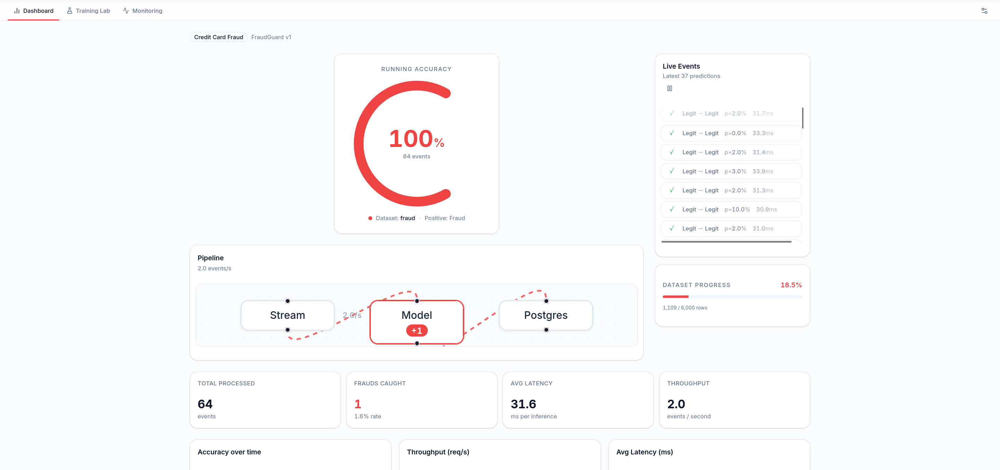
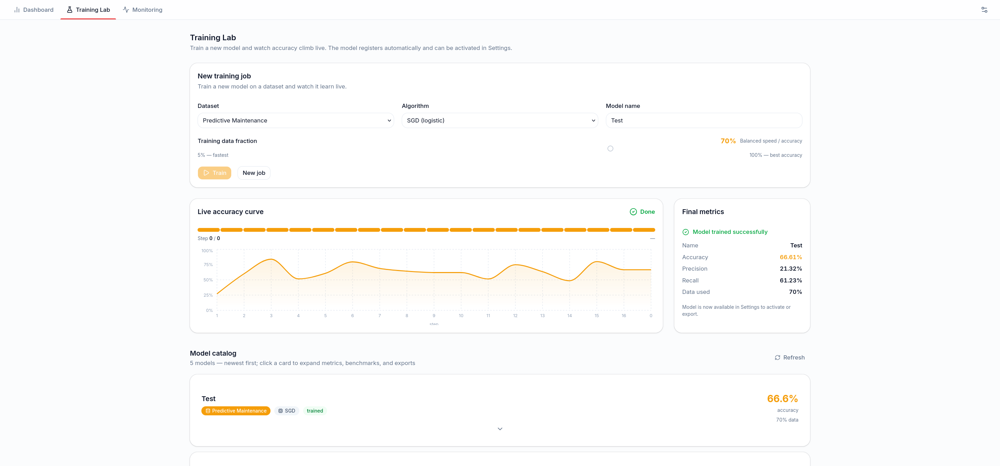
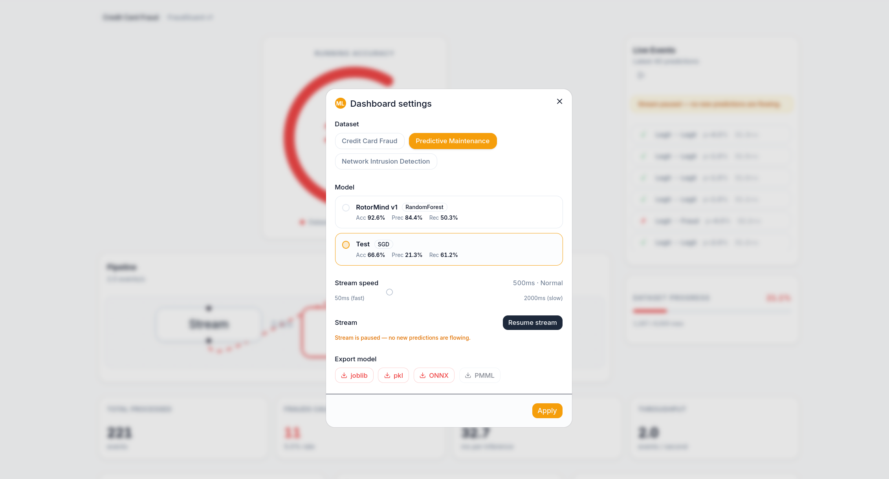
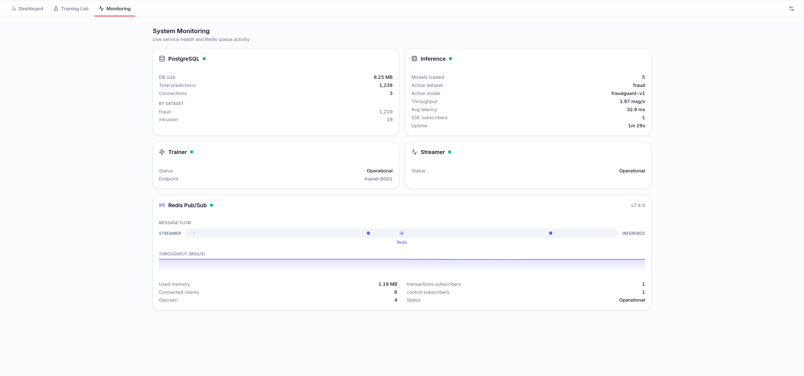

# MLOps Real-Time ML Monitoring

A real-time MLOps monitoring system. A streaming service replays dataset rows through Redis,
a FastAPI inference service classifies each event with a pre-trained scikit-learn model,
results persist to PostgreSQL, and a Next.js dashboard visualizes model performance live.



---

## What it does

The system solves three binary classification problems simultaneously, all with ground-truth
labels in the stream:

| Slug | Domain | Positive class | Committed model |
|---|---|---|---|
| `fraud` | Credit card fraud detection | Fraud transaction | FraudGuard v1 (RF, acc 0.934) |
| `iot` | Predictive machine maintenance | Equipment failure | RotorMind v1 (RF, acc 0.926) |
| `intrusion` | Network intrusion detection | Attack traffic | NetGuard v1 (RF, acc 0.944) |

Because every stream message carries the ground-truth label, the hero metric — the central
accuracy gauge — is a real running accuracy (`correct / total`), not a simulated value.

You can switch dataset and model live from the settings popup. The Training Lab lets you
train a new model from the UI and watch accuracy climb in real time.

---

## Feature tour

**Dashboard** — accuracy gauge, pipeline flow, live prediction feed, KPI cards, metrics charts,
and a benchmark surface showing the active model's current-run stats versus its last saved run.


**Training Lab** — pick a dataset, algorithm, and training fraction (5%–100%), start a job,
watch the live accuracy curve, then use or download the resulting model.



**Settings** — switch dataset or model live, adjust stream speed, pause/resume, download the
active model in any available format (joblib, pickle, ONNX; PMML is disabled on this runtime — see below).



**Monitoring** — live service cards for PostgreSQL, inference, trainer, and streamer; an
animated Redis panel with pubsub subscriber counts, throughput sparkline, and ops/sec.



---

## Architecture

```
            ┌──────────────────────────────────────────────────────────────────┐
            │                        docker compose (6 containers)              │
            │                                                                   │
 CSV ──▶ streamer ──▶ Redis (transactions) ──▶ inference ──INSERT──▶ PostgreSQL │
            ▲                                      │  joblib.load, .predict()   │
            └──── Redis (control) ◀────────────────┤                            │
                                                   │ SSE + REST                 │
                                                   ▼                            │
                                             dashboard (Next.js)                │
                                             trainer (FastAPI) ◀── Training Lab │
            └──────────────────────────────────────────────────────────────────┘
                                                   ▲
                                              browser (operator)
```

### Containers

| Container | Tech | Port | Role |
|---|---|---|---|
| `postgres` | PostgreSQL 16 | 5432 | Durable store — predictions, model catalog, benchmark runs |
| `redis` | Redis 7 | 6379 | Pub/sub broker: `transactions` and `control` channels |
| `streamer` | Python | — | Replays CSV rows to Redis at a controllable rate |
| `inference` | FastAPI | 8000 | Loads models, classifies events, writes DB, serves SSE + REST |
| `trainer` | FastAPI | 8001 | Live Training Lab — trains new models on demand, exports, registers |
| `dashboard` | Next.js | 3000 | Animated real-time UI, controls, model export, Training Lab |

The four logical units required by the assignment (database, streamer, central application,
dashboard) map to four of the six containers. Redis and the trainer are auxiliary services.

### Why Redis

The streamer and inference run in separate containers with no shared memory. Redis pub/sub
decouples them: the streamer publishes one JSON message per row to the `transactions` channel;
inference subscribes and processes each message independently. The same broker carries the
`control` channel in the opposite direction — when the dashboard changes speed, pause state, or
active dataset, inference publishes the command to `control` and the streamer picks it up.
Direct HTTP between services would couple them tightly and make the control path awkward;
a full message broker like Kafka is unnecessary overhead at this scale.

### Data flow (one event)

1. Streamer reads the next CSV row, builds `{ dataset, features, actual }`, publishes to `transactions`, sleeps `interval_ms`.
2. Inference receives the message, selects the active model for the dataset, calls `model.predict()` and `predict_proba()`.
3. Inference computes `is_correct` and `latency_ms`, inserts a row into `predictions` (thread pool, off the event loop).
4. Inference pushes a compact event with running aggregates onto all active SSE queues.
5. Dashboard reads `GET /stream` (SSE) for the live gauge and feed; reads `GET /metrics`, `/history`, `/progress` (REST, PostgreSQL) for charts and KPIs.

### Control path (live, from UI)

1. Operator changes speed / pause / dataset / model in the settings popup.
2. Dashboard `POST /control` to inference.
3. Inference applies the change locally and publishes to Redis `control`.
4. Streamer reads the command, updates `interval_ms` / `paused`, or loads the new dataset CSV.

---

## ML lifecycle

### 1. Train (offline)

```bash
cd training
python train.py --dataset fraud     --algo random_forest --name "FraudGuard v1"
python train.py --dataset iot       --algo random_forest --name "RotorMind v1"
python train.py --dataset intrusion --algo random_forest --name "NetGuard v1"
```

`train.py` loads the CSV, fits a `StandardScaler` and `RandomForestClassifier`
(stratified split, `class_weight="balanced"`), evaluates on the held-out test split, and
writes all artifacts to `models/<dataset>/`.

### 2. Serialize and export

| Format | File | Notes |
|---|---|---|
| joblib | `<slug>.joblib` | Primary format — what inference loads at startup |
| pickle | `<slug>.pkl` | Generic Python serialization |
| ONNX | `<slug>.onnx` | Portable via `skl2onnx` |
| PMML | `<slug>.pmml` | XML standard via `sklearn2pmml`. A JRE ships in the trainer image, but conversion fails on this scikit-learn version, so it is `null` |

`train.py` also writes `scaler.joblib` and `metadata.json`, and updates `models/registry.json`.
The metadata carries column names, class labels, metrics, and the available format list —
without it the `.joblib` file is opaque.

PMML is `null` for all three committed models. The trainer image ships a JRE, but `sklearn2pmml`
conversion fails on this scikit-learn version, so PMML is gracefully skipped. See
[docs/07-ml-lifecycle.md](docs/07-ml-lifecycle.md) for details.

### 3. Inference (runtime, serving path)

At startup, inference reads `registry.json` and calls `joblib.load` on every model and scaler
into memory. On each event it scales the features and calls `model.predict()` +
`predict_proba()`. **It never calls `.fit()`.**

The `trainer` service is the only place model fitting happens at runtime, and only when a
user explicitly starts a training job from the Training Lab. The serving path is isolated
from the training path.

### 4. Model registry

`models/registry.json` is the single source of truth. Inference syncs it into a Postgres
`models` table on every startup and after every `/reload`. Rows not present in the registry
are pruned in the same sync. The trainer also writes a `models` row (`source='trained'`) after
each completed job.

### 5. Download from the dashboard

`GET /models/{dataset}/{slug}/export?format=joblib|pickle|onnx|pmml` streams the
pre-generated file as a download. The settings popup shows one button per format; `null`
formats are disabled.

### 6. Live Training Lab (trainer service)

1. Pick dataset, algorithm, name, and training fraction (5%–100%) in the Training Lab; click Train.
2. Dashboard `POST trainer:/train` → receives a `job_id`.
3. Dashboard opens `GET /train/stream?job_id=` (SSE). The trainer fits incrementally
   (`RandomForestClassifier` with `warm_start=True`, growing `n_estimators` in batches) and
   emits `{ step, total, accuracy, status }` after each batch. The accuracy curve climbs on screen.
4. On completion the trainer exports all formats, writes `<slug>.metadata.json`, upserts
   `registry.json`, writes a `models` row to Postgres, and calls `POST inference:/reload`.
5. Inference reloads the registry. The new model appears in the settings popup within seconds.

---

## Quickstart

### Prerequisites

Docker and Docker Compose v2. Ports 3000, 8000, 8001, 5432, and 6379 free on the host.

### Run

```bash
cp .env.example .env
docker compose up --build
```

First build takes several minutes (Python and Node dependencies). Subsequent starts are fast.

| Service | URL |
|---|---|
| Dashboard | http://localhost:3000 |
| Inference API | http://localhost:8000/health |
| Trainer API | http://localhost:8001/health |

If port 3000 is taken, set `DASHBOARD_PORT` in `.env` before running:

```
DASHBOARD_PORT=3001
```

### Stop

```bash
docker compose down       # stop containers, keep the postgres volume
docker compose down -v    # stop and delete the postgres volume
```

### Environment variables

All config lives in `.env` (copy from `.env.example`). Key variables:

| Variable | Default | Description |
|---|---|---|
| `POSTGRES_USER` | `mlops` | PostgreSQL user |
| `POSTGRES_PASSWORD` | `mlops_secret_change_me` | PostgreSQL password |
| `POSTGRES_DB` | `mlops` | PostgreSQL database name |
| `POSTGRES_PORT` | `5432` | Host port for PostgreSQL |
| `DATABASE_URL` | `postgresql+psycopg2://...` | DSN for inference (psycopg2) |
| `REDIS_PORT` | `6379` | Host port for Redis |
| `REDIS_URL` | `redis://redis:6379/0` | Redis connection URL |
| `START_DATASET` | `fraud` | Starting dataset slug |
| `START_INTERVAL_MS` | `500` | Initial publish interval in ms |
| `INFERENCE_PORT` | `8000` | Host port for inference service |
| `TRAINER_PORT` | `8001` | Host port for trainer service |
| `DASHBOARD_PORT` | `3000` | Host port for dashboard |
| `NEXT_PUBLIC_INFERENCE_URL` | `http://localhost:8000` | Browser-reachable inference URL |
| `NEXT_PUBLIC_TRAINER_URL` | `http://localhost:8001` | Browser-reachable trainer URL |

---

## How to use

**Switch dataset or model live:** open the settings gear (top-right), pick a dataset and model,
click Apply. The stream switches within one event cycle; no container restart needed.

**Training Lab:** click the Training Lab tab, pick a dataset and algorithm, drag the fraction
slider (default 70%), type a model name, and click Train. Watch accuracy climb on the live
curve. After training completes, the model appears in the model cards and in the settings popup.

**Export a model:** in the settings popup, click the format button (joblib / pickle / ONNX).
PMML is greyed out — `sklearn2pmml` conversion currently fails on this scikit-learn version.

**Monitoring:** click the Monitoring tab to see live status for all four services and the Redis
broker. Stop the streamer container — the streamer card flips to `down` within 6 seconds.

**Benchmark runs:** every time you select a model, inference starts accumulating accuracy,
latency, throughput, and confusion stats. When you switch to a different model (or after
30 seconds idle), it writes a `model_runs` row. The Dashboard tab shows the live current-run
panel alongside the saved last-run for comparison.

---

## Swapping in the real Kaggle datasets

The repo ships synthetic sample data at `data/<slug>/sample.csv`. The system runs entirely
offline with these files. To use the real public datasets:

**fraud** — [Credit Card Fraud Detection](https://www.kaggle.com/datasets/mlg-ulb/creditcardfraud)
- Rename `Time` → `hour`, `V1`–`V6` → `v1`–`v6`, `Amount` → `amount`, `Class` → `is_fraud`.
- Drop the remaining V columns.

**iot** — [AI4I 2020 Predictive Maintenance](https://www.kaggle.com/datasets/shivamb/machine-predictive-maintenance-classification)
- Rename `Air temperature [K]` → `air_temp`, `Process temperature [K]` → `process_temp`,
  `Rotational speed [rpm]` → `rotational_speed`, `Torque [Nm]` → `torque`,
  `Tool wear [min]` → `tool_wear`, `Machine failure` → `failure`.
- Collapse all failure sub-type columns to a single binary `failure` (0/1).

**intrusion** — [NSL-KDD](https://www.kaggle.com/datasets/hassan06/nslkdd) (`KDDTrain+.txt`)
- Keep: `duration`, `src_bytes`, `dst_bytes`, `count`, `srv_count`.
- Encode `protocol_type` → `protocol` (integer), `flag` → `flag` (integer).
- Rename label: `label` → `attack` (0 = normal, 1 = attack).

After replacing the CSV:

```bash
cd training
python train.py --dataset <slug> --algo random_forest --name "<Model Name>"
docker compose up --build
```

No code changes required anywhere else. The streamer and inference read columns by name.

---

## Tech stack

| Layer | Technology |
|---|---|
| Stream broker | Redis 7 pub/sub |
| Database | PostgreSQL 16 + SQLAlchemy Core (psycopg2 in inference, psycopg3 in trainer) |
| Inference API | FastAPI + uvicorn + sse-starlette |
| Trainer API | FastAPI + uvicorn + sse-starlette |
| ML | scikit-learn (RandomForest, SGD), joblib, skl2onnx |
| Dashboard | Next.js App Router, shadcn/ui, Tailwind, Motion, Recharts, React Flow |
| Container | Docker Compose (6 services, healthchecks, dependency order) |

---

## Project structure

```
.
├── data/                   # Dataset CSVs (synthetic samples committed; real files go here)
│   ├── fraud/sample.csv
│   ├── iot/sample.csv
│   └── intrusion/sample.csv
├── models/                 # Trained model artifacts (committed, not generated at runtime)
│   ├── registry.json
│   ├── fraud/              # fraudguard-v1.joblib, .pkl, .onnx, scaler.joblib, metadata.json
│   ├── iot/
│   └── intrusion/
├── training/               # Offline training scripts
│   ├── train.py
│   └── generate_data.py
├── inference/              # FastAPI inference service (port 8000)
├── trainer/                # FastAPI trainer service — Training Lab (port 8001)
├── streamer/               # Python streaming worker (no HTTP port)
├── dashboard/              # Next.js dashboard (port 3000)
├── docs/                   # Extended documentation
│   └── img/                # Screenshots
├── docker-compose.yml
└── .env.example
```

---

## Documentation

Full reference docs live in [docs/](docs/):

| File | Contents |
|---|---|
| [docs/README.md](docs/README.md) | Documentation index |
| [docs/01-overview.md](docs/01-overview.md) | Problem, goals, feature tour, glossary |
| [docs/02-architecture.md](docs/02-architecture.md) | Containers, data flow, design decisions |
| [docs/03-workflow.md](docs/03-workflow.md) | End-to-end workflows with message shapes |
| [docs/04-getting-started.md](docs/04-getting-started.md) | Prerequisites, env vars, dataset swap, troubleshooting |
| [docs/05-data-model.md](docs/05-data-model.md) | Postgres tables, registry.json shape, Redis channels |
| [docs/06-api-reference.md](docs/06-api-reference.md) | Every endpoint on inference and trainer |
| [docs/07-ml-lifecycle.md](docs/07-ml-lifecycle.md) | Offline training, serialization, live training, benchmarks |
| docs/services/inference.md | Inference service internals |
| docs/services/trainer.md | Trainer service internals |
| docs/services/streamer.md | Streamer internals |
| docs/services/postgres.md | PostgreSQL schema and queries |
| docs/services/redis.md | Redis configuration and channels |
| docs/services/dashboard.md | Dashboard components and SSE client |

---

## Assignment compliance

**Model never trained at serving time.** `training/train.py` is the only script that calls
`.fit()` offline. Pre-trained artifacts are committed to `models/`. The inference service loads
models with `joblib.load` at startup and calls only `.predict()` on the hot path. The trainer
service runs training jobs at user request but is isolated — inference hot-reloads finished
artifacts via `POST /reload` and never runs `.fit()` itself.

**Four logical units.** The assignment's database, streamer, central application, and dashboard
map to `postgres`, `streamer`, `inference`, and `dashboard`. Redis and `trainer` are auxiliary
infrastructure that support those units without blurring their boundaries.

**Ground-truth accuracy.** Each dataset includes a label column in every stream message.
Inference computes `is_correct = prediction == actual` per event and persists it. The dashboard
gauge shows the true running accuracy.

## License

Released under the [MIT License](LICENSE).
